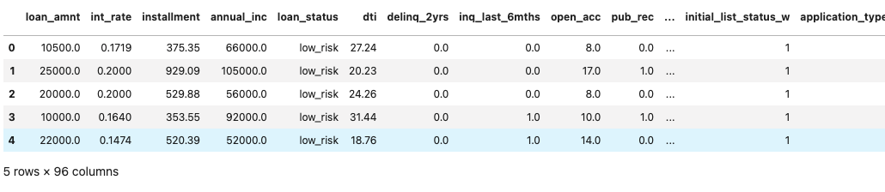
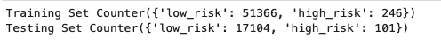

# Credit Risk Analysis

## Overview

This project involved the use of supervised machine learning to develop a model that can predict the credit risk of loans based on criteria categorizing each application.  The goal is to look at the strength and weaknesses of several modeling methods using various sampling methods and ensemble modeling to determine if any will be able to improve the ability to predict the risk associated with each loan.  For this we have an existing dataset that contains the categories to be used for developing the models and the risk status of each.  These were used to create training and testing sets to evaluate the predictive strength of each model.  Each model will then be evaluated against each other to determine the strengths and weakness of each based on the accuracy of the model, precision and sensitivity, and the values presented in a confusion matrix.

---

## Results

Data containing a number of loans was used to create and test the models for predicting loan risk.  The initial dataset was imported into Jupyter Notebook with 68817 loans and 85 columns of data for each loan.

The data contained a number of columns in which the data was stored as a string which required encoding to be completed to parse each data type from these rows into new columns defined with 0 or 1 as a binary indicator of the status for those columns.  The loan status would be the used as the target data set which would be removed from the other columns which will be the features for the development of the models.

From the encoded dataset of loan applications a total of 68470 loans were classified as low risk and the other 347 loans were determined to be high risk.  This imbalance in the distribution of the high risk applications requires that the testing and training dataset be carefully selected to ensure that the high risk applications can be fairly evaluated against the low risk cases.  The data was separated into a 75-25 percent split of training data and testing data.  The testing data contained 51366 low-risk cases with 246 high-risk cases and the testing data contained 17104 low-risk cases and 101 high-risk cases.

### Oversampling

#### Naive Random Oversampling

Due to the unbalanced nature of the dataset the use of oversampling can help even ensure that the evaluation has an adequate number of high risk cases in the sample set.  Using the RandomOverSample method found in the imblearn module, the original training set is resampled to select many high risk cases. As we do not have these cases, estimates of the high risk data is made based on the existing data to increase the number of high risk cases. Using this method the total of high-risk cases are equal to the original test data for the low-risk cases (51366). Using LogisticRegression a model is created to be used with the testing set to evaluate the quality of the model. 

- Training set increased high risk loan samples from 246 to 51366

- Accuracy of the model calculated as 65%

- Confusion matrix show low accuracy for predicting low risk loans correctly and approximately 70% accuracy for predicting high risk loans

- Classification report below show that the sensitivity and specificity of the model is quite low for both high and low risk predictions with a similar sensitivity and specificity for both low and high risk loans. 

<table>
    <tr>
        <td>Training set</td>
        <td>Accuracy</td>
        <td>Confusion Matrix</td>
    </tr>
    <tr>
        <td></td>
        <td></td>
        <td></td>
    </tr>
</table>

<table>
    <tr>
        <td>Imbalanced Classification Report</td>
    </tr>
    <tr>
        <td></td>
    </tr>
</table>

#### SMOTE Oversampling

Another method of oversampling is SMOTE which used estimates based on the closest neighbor values to increase the number of high risk cases.  Similar to the previous example we end up with equal numbers of low and high risk values to be used in the model.  Again using the LogisticRegression model the data is fit and evaluated for the performance.  

- Training set increased high risk loan samples from 246 to 51366 as seen in the previous model

- Accuracy of the model calculated as 65%

- Confusion matrix show increased the number of low risk loans predicted correctly but reduced the accuracy for high risk loan prediction to approximately 61%.

- Classification report below show that the sensitivity and specificity of the model was still low for both high and low risk predictions however there was an increase in the sensitivity for low risk loans and an increase of specificity for high risk loans.

<table>
    <tr>
        <td>Training set</td>
        <td>Accuracy</td>
        <td>Confusion Matrix</td>
    </tr>
    <tr>
        <td></td>
        <td></td>
        <td></td>
    </tr>
</table>

<table>
    <tr>
        <td>Imbalanced Classification Report</td>
    </tr>
    <tr>
        <td></td>
    </tr>
</table>

### Undersampling

Counter to the use of oversampling to manage the unbalanced data, undersampling can act as a method to provide a better representation of the lesser values for the creation of a working model for predicting outcomes.  Undersampling involves selecting a reduced number of low risk cases to balance with the number of high risk cases.  In this case we end up with a total of 246 of each to be modeled using the LogisticRegression module to create a model based on the new training dataset.   

- Training set reduced the low risk loan samples from 51366 to 246

- Accuracy of the model calculated as 55%

- Confusion matrix show low accuracy for predicting low risk loans correctly and approximately 70% accuracy for predicting high risk loans similar to what was observed in the first oversampling model tested

- Classification report below show that the sensitivity and specificity of the model is quite low for both high and low risk predictions however there was a large lose of specificity for the prediction of low risk loans and a small increase in the sensitivity of the high risk loans. 

<table>
    <tr>
        <td>Training set</td>
        <td>Accuracy</td>
        <td>Confusion Matrix</td>
    </tr>
    <tr>
        <td></td>
        <td></td>
        <td></td>
    </tr>
</table>

<table>
    <tr>
        <td>Imbalanced Classification Report</td>
    </tr>
    <tr>
        <td></td>
    </tr>
</table>

### Combination sampling

To further look at how the dataset can be manipulated to provide a training set that can help improve the fit of the model, combination sampling using the SMOTEENN algorithm attempt to combine both under and oversampling methods to create a balanced training set.  Using this method a training set made up of 51361 high-risk and 46653 low-risk cases were created.  

- Training set reduced the high risk loan samples from 246 to 46653

- Accuracy of the model calculated as 65%

- Confusion matrix show low accuracy for predicting low risk loans correctly and approximately 72% accuracy for predicting high risk loans a small increase to what was observed in the oversampling and undersampling models presented earlier.

- Classification report below show that the sensitivity and specificity of the model is quite low for both high and low risk predictions however there was a large increase of sensitivity for the prediction of low risk loans compared to previous model and a small increase in the specificity of the high risk loans.

<table>
    <tr>
        <td>Training set</td>
        <td>Accuracy</td>
        <td>Confusion Matrix</td>
    </tr>
    <tr>
        <td></td>
        <td></td>
        <td></td>
    </tr>
</table>

<table>
    <tr>
        <td>Imbalanced Classification Report</td>
    </tr>
    <tr>
        <td></td>
    </tr>
</table>

### Ensemble Learners

Ensemble learners use multiple decision trees to determine the predictive strength of each variable to determine the contribution to the final model can be defined by each characteristic.  For this model there are 95 factors used to develop the predictive model which when placed in a decision tree show the complexity of the model.  Below is the image of the overall decision tree for the development of a model for predicting the outcome of the loan risk.  As the image shows the high degree of variability between what determine what is a high risk and low risk loan which adds to the complexity of this model.

#### Balanced Random Forest Classifier

As the name suggests the random forest classifier algorithm uses many decision trees (forest) to evaluate the accuracy of each to prioritize variable that more accurately predict the outcome of the loans.  For this case, 100 decision trees were evaluated to determine the elements that contribute the most to the prediction of the correct loan risk.  Using the BalancedRandomForestClassifier algorithm was used to create the model using multiple decision trees to evaluate the priority of the features for the model. The figure below shows the first estimator decision tree used in the set to determine the final model.  

The complexity of the model can be observed however compared to the complete decision tree it has been simplified.  This is repeated multiple time to evaluate the ability of the decision tree to estimate the test set accurately.  The image below highlights the first 5 estimators used to create this model.

Based on this model the following observations could be made:

- Accuracy of the model calculated as 87%

- Confusion matrix show improved accuracy for predicting both low risk loans and high risk loan as compared to the undersampling and oversampling models

- Classification report below show that the sensitivity and specificity of the model increased substantially for both high and low risk predictions with the sensitivity and specificity for high risk loans of 0.92 and 0.94 respectively.

<table>
    <tr>
        <td>Accuracy</td>
        <td>Confusion Matrix</td>
    </tr>
    <tr>
        <td></td>
        <td></td>
    </tr>
</table>

<table>
    <tr>
        <td>Imbalanced Classification Report</td>
    </tr>
    <tr>
        <td></td>
    </tr>
</table>

Based on this method the features used to develop the prediction can be ranked by their contribution to the final model.  Below is a graph showing the percentage each feature contributes to the predictive model.  This shows that a few factors contribute the most other and that there are a number of factors that have little impact to the final predictions.

#### Easy Ensemble AdaBoost Classifier

Another method to improve the accuracy of a model is to use boosting which trains weak models over multiple iterations to improve the ability to estimate the outcome by giving higher priority to observations that the previous model predicted incorrectly.

- Accuracy of the model calculated as 94%

- Confusion matrix show improved accuracy for predicting both low risk loans and high risk loan as compared to the Balanced Random Forest method

- Classification report below show that the sensitivity and specificity of the model remains unchanged for both high and low risk predictions compared with the Balanced Random Forest method with the sensitivity and specificity for high risk loans of 0.92 and 0.94 respectively.

<table>
    <tr>
        <td>Accuracy</td>
        <td>Confusion Matrix</td>
    </tr>
    <tr>
        <td></td>
        <td></td>
    </tr>
</table>

<table>
    <tr>
        <td>Imbalanced Classification Report</td>
    </tr>
    <tr>
        <td></td>
    </tr>
</table>

---

## Summary

The models developed show the complexity of developing a model to accurately predict the outcome based on the features given.  The six models presented show that when confronted with imbalanced data it is difficult to create a clear separation of the dataset if there is a region of overlap between the two datasets.  This is evident with the loan data being evaluated in this project.  Increases in accuracy of one target resulted in decreases in the other with it being difficult to accurately predict the outcome of one or both target factors.  Though the risk of over testing using the dataset is a concern none of the models tested provided any evidence that occurred.  The conclusion of this project is not straight forward, however the Adaboost model did provide the greatest accuracy and predictability of all the models tested.  The decision to determine if this model should be used for the prediction of loans is dependent of the risk associated with this model.  This model was highly accurate (94%) at predicting high risk loans allowing only 8 of the 101 test examples to be predicted incorrectly.  This however did result in 943 low risk loans to be classified as high risk which is over 9 times higher than the total high risk loans in the orignal data set.  It must be determined if the losses incurred by rejecting 943 low risk loans is greater than the losses incurred with the 8 high risk loans. Additionally, it must be determined if the risk associated with the existing method that would result in 346 high risk loans against the 68470 low risk loans would result in revenue losses that would make the use of this model a good option.  Without this information it is not possible to accept any test as it requires a more detailed evaluation of the economic impact of the decision to use the predictive model.

---